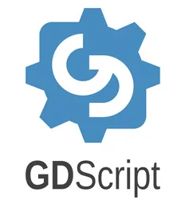
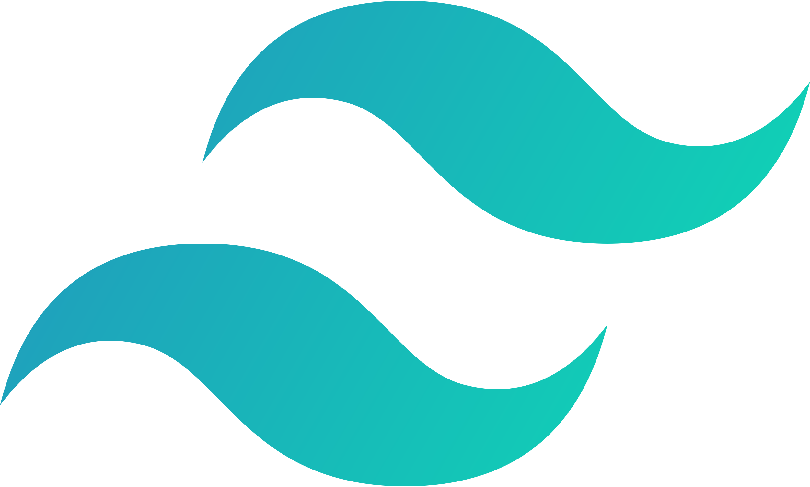

<!-- my introduction -->

  <h1> hi, i'm emily! </h1>

<!-- my linkedln and spotify link -->
  

   &nbsp;&nbsp;
   &nbsp;&nbsp;
  

<!-- quote -->
  <h5 align="center">
   <i> 🌟 a winner is just a loser who tried one more time. 🌟 </i>
  </h5>

 
<!-- gif -->
 

<!-- about me -->

  <h3> i'm 21 years old software engineer from atlanta, ga</h3>

 - 🍙 current working on: web development bootcamp
 - 🍣 interested in: full stack development, data science, cybersecurity & ui/ux design
 - 🍥 mostly into web development, but also a bit of everything else 💙
 - 🍱 i love to learn new things and build amazing stuff ✈️
 - 💬 ask me about anything!

 

  <h4> software developer | gamer | esports | coach | musician  </h4>
   

<!-- extra spaces -->

&nbsp

&nbsp

&nbsp

<!-- skills -->
### programming languages:

 
   <a href="https://www.java.com/en/" target="_blank" rel="noreferrer"> 
  <a href="https://www.python.org/" target="_blank" rel="noreferrer"> 
  <a href="https://developer.mozilla.org/en-US/docs/Web/HTML" target="_blank" rel="noreferrer"> 
  <a href="https://developer.mozilla.org/en-US/docs/Web/CSS" target="_blank" rel="noreferrer"> 
  
  <a href="https://www.r-project.org/about.html" target="_blank" rel="noreferrer"> 
  <a href="https://www.microsoft.com/en-us/sql-server/sql-server-downloads" target="_blank" rel="noreferrer"> 
  <a href="https://docs.godotengine.org/en/stable/tutorials/scripting/gdscript/gdscript_basics.html" target="_blank" rel="noreferrer"> 
  <a href="https://kotlinlang.org/" target="_blank" rel="noreferrer">
 
### developer tools:

  <a href="https://godotengine.org/" target="_blank" rel="noreferrer"> 
  <a href="https://react.dev/" target="_blank" rel="noreferrer"> 
  <a href="https://nextjs.org/" target="_blank" rel="noreferrer"> 
  <a href="https://tailwindcss.com/" target="_blank" rel="noreferrer"> 
  <a href="https://getbootstrap.com/" target="_blank" rel="noreferrer"> 
  <a href="https://nodejs.org/en" target="_blank" rel="noreferrer"> 
  <a href="https://visualstudio.microsoft.com/" target="_blank" rel="noreferrer">
  <a href="https://code.visualstudio.com/" target="_blank" rel="noreferrer">
    <a href="https://www.jetbrains.com/idea/" target="_blank" rel="noreferrer">

### applications:

  <a href="https://www.adobe.com/products/aftereffects.html" target="_blank" rel="noreferrer"> 
  <a href="https://www.adobe.com/products/premiere.html" target="_blank" rel="noreferrer"> 
  <a href="https://www.adobe.com/products/photoshop.html" target="_blank" rel="noreferrer"> 
  <a href="https://figma.com/" target="_blank" rel="noreferrer"> 
  <a href="https://www.microsoft.com/en-us/microsoft-365/excel" target="_blank" rel="noreferrer"> 

<!-- extra spaces -->

&nbsp

<!-- language stats -->

  

